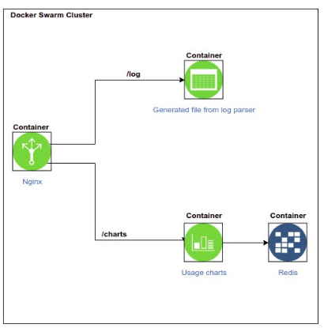

<h2>Python scripts:</h2>
We already talked about automation and how it makes our life a lot easier by taking away the dull tasks and give us more free time to focus on more important subjects , let computers do what they are meant to do which are boring and repeatable tasks and we do what we were supposed to do to make and to create what we imagine ...
So I suppose you might be asking if we have bash scripts on our hand why would we need python ? well that is a great question but as you work more with bash scripts and develop more experience the bash language limitations will unfold themselves for example suppose that you have assigned to write a small program to graph system metrics - such as cpu usage - and serve them through a webpage how on earth is that possible to do that with bash scripts? or if it is possible , how hard could that be and how much time does it need? cost vs benefit is always in play :)
As a rule of thumb it is suggested that whenever your bashcript is getting longer than 150 lines you must switch to python to do a more efficient job, without a doubt version control and update could be a lot more easier this way

<h2>Project</h2>

Implement the HAProxy log analyzer which you've written in bash and see the difference 
print the output logs to a file which is accessible by `/log` through Nginx

Through python grab system metrics such as - CPU , RAM & Disk usage-
make a graph out of those metrics using plotly library which is accessible by `/charts` through Nginx
save those metrics in redis DB

do all configurations through ansible -as much as possible-

